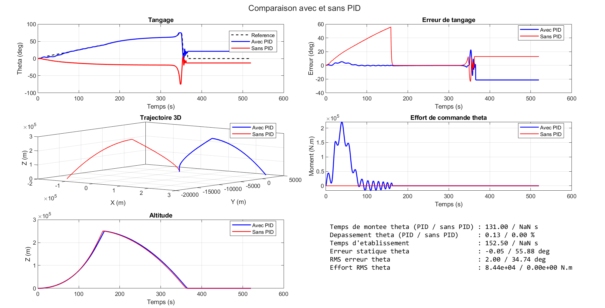
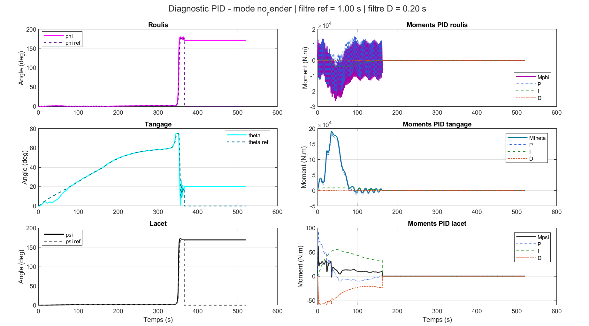
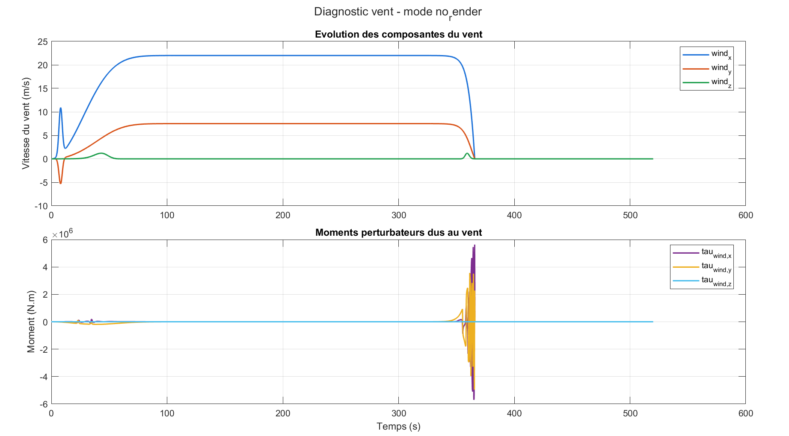
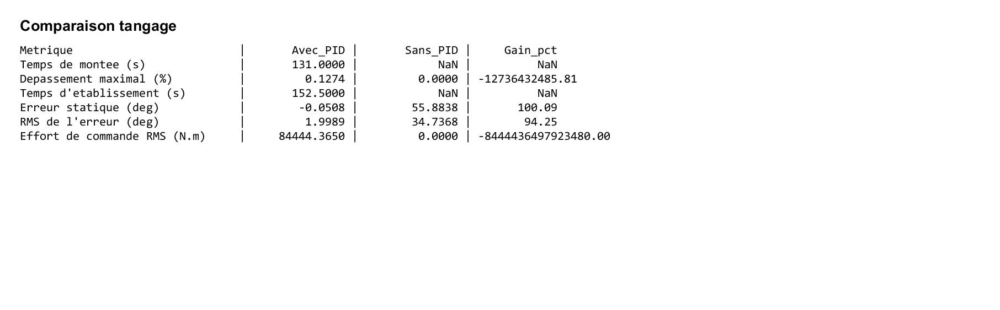
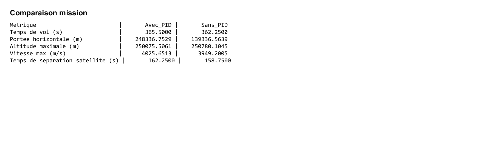

# Vega Simulations

## Vue d'ensemble

`Vega Simulations` regroupe un projet MATLAB de simulation 3D d'un lanceur inspire de Vega-C, enrichi par :

- une commande d'attitude par correcteur PID ;
- une comparaison systematique entre les cas avec et sans PID ;
- un modele de vent plus realiste base sur la vitesse relative de l'air ;
- des exports automatiques de figures, tableaux, journaux, videos et documents de memoire.

L'objectif du projet est double :

1. construire un modele numerique interpretable pour l'etude de la dynamique d'un lanceur en phase propulsee ;
2. produire des resultats directement exploitables dans un rapport scientifique ou un memoire.

## Structure du dossier

```text
Vega Simulations/
|- src/
|  |- controle_pid/
|  |  `- modele_vega_PID_ok.m
|  `- comparaison/
|     |- compare_pid_vs_no_pid.m
|     `- sweep_pid_gains_to_excel.m
|- out/
|  |- blender/
|  |- images/
|  |- logs/
|  `- videos/
|- docs/
|  |- figures/
|  |- tableaux/
|  |- memoire_vega.docx
|  |- memoire_vega_v2.docx
|  |- sections_memoire_resultats_maj.md
|  `- legendes_memoire.txt
|- README.md
`- README_memoire_universitaire.md
```

## Scripts principaux

### `src/controle_pid/modele_vega_PID_ok.m`

C'est le coeur du projet. Ce script :

- simule la dynamique 3D du lanceur ;
- gere la masse variable et les etages de vol ;
- applique une commande PID sur `phi`, `theta` et `psi` ;
- prend en compte un vent aerodynamique plus realiste ;
- exporte automatiquement les figures et les diagnostics.

### `src/comparaison/compare_pid_vs_no_pid.m`

Ce script compare deux simulations :

- une simulation avec PID actif ;
- une simulation sans PID.

Il calcule notamment :

- le temps de montee ;
- le depassement maximal ;
- le temps d'etablissement ;
- l'erreur statique ;
- la RMS de l'erreur ;
- l'effort de commande RMS ;
- plusieurs indicateurs globaux de mission.

### `src/comparaison/sweep_pid_gains_to_excel.m`

Ce script automatise une etude de sensibilite des gains PID. Il lance plusieurs simulations avec des jeux de gains differents et exporte un fichier Excel de synthese.

## Figures de simulation

Les figures ci-dessous correspondent directement aux sorties reelles generees par les scripts dans `out/images/`. Elles reflètent donc la version actuelle du modele avec vent realiste.

### 1. Dashboard de comparaison PID / sans PID

Fichier :
- `out/images/compare_pid_dashboard.png`

Role :
- donner une vue globale de la difference entre le cas avec PID et le cas sans PID ;
- visualiser la trajectoire, l'altitude, le tangage et l'effort de commande dans une meme figure.

Lecture :
- si les courbes avec PID suivent mieux la reference et restent plus regulieres, cela traduit un meilleur pilotage du lanceur ;
- cette figure est la plus utile pour une lecture rapide des performances globales.



### 2. Diagnostic PID du modele

Fichier :
- `out/images/modele_vega_PID_ok_pid.png`

Role :
- montrer les angles d'attitude reels et leurs references ;
- afficher les moments PID et les contributions `P`, `I`, `D`.

Lecture :
- on y verifie si les angles `phi`, `theta`, `psi` suivent correctement leurs consignes ;
- on observe aussi si les moments de commande restent raisonnables ou s'approchent de la saturation.



### 3. Diagnostic du vent

Fichier :
- `out/images/modele_vega_PID_ok_wind.png`

Role :
- afficher les composantes du vent `wind_x`, `wind_y`, `wind_z` ;
- visualiser les moments perturbateurs aerodynamiques `tau_wind_x`, `tau_wind_y`, `tau_wind_z`.

Lecture :
- cette figure permet d'interpreter les perturbations appliquees au modele ;
- elle est utile pour relier le comportement du PID aux efforts aerodynamiques dus au vent.



### 4. Tableau image des performances en tangage

Fichier :
- `out/images/compare_pid_pitch_table.png`

Role :
- resumer les indicateurs de performance en tangage dans une image directement inserable dans le memoire.

Lecture :
- on y lit le temps de montee, le depassement, le temps d'etablissement, l'erreur statique, la RMS et l'effort de commande ;
- c'est la figure la plus importante pour la comparaison quantitative du controle.



### 5. Tableau image des indicateurs de mission

Fichier :
- `out/images/compare_pid_mission_table.png`

Role :
- presenter les grandeurs globales de mission dans une forme exploitable pour le memoire.

Lecture :
- on y compare le temps de vol, la portee, l'altitude maximale, la vitesse maximale et le temps de separation du satellite ;
- cette figure montre si l'ajout du PID change ou non la logique generale de la mission.



## Tableaux et documents de synthese

Les tableaux numeriques de reference sont ceux exportes dans `out/logs/`, tandis que `docs/tableaux/` contient des copies ou mises en forme utiles pour le memoire.

### Tableaux de comparaison principaux

- `out/logs/compare_pid_pitch_table.csv` et `out/logs/compare_pid_pitch_table.txt`
- `out/logs/compare_pid_mission_table.csv` et `out/logs/compare_pid_mission_table.txt`
- `out/logs/compare_pid_vs_no_pid.xlsx`

Utilite :
- le tableau de tangage sert a analyser finement la reponse du correcteur ;
- le tableau de mission sert a verifier que la commande n'altere pas la coherence globale du scenario ;
- le classeur Excel rassemble une vue plus complete des entrees, sorties et series temporelles.

### Tableaux de reglage PID

- `docs/tableaux/tableau_choix_gains_pid.xlsx`
- `docs/tableaux/tableau_choix_gains_pid.docx`

Utilite :
- expliquer la methode de choix de `Kp`, `Ki` et `Kd` ;
- fournir un support pedagogique sur le dimensionnement du correcteur.

### Tableaux de sweep PID

- `docs/tableaux/tableau_recap_sweep_pid.xlsx`
- `docs/tableaux/tableau_recap_sweep_pid.docx`
- `out/logs/pid_gain_sweep.xlsx`
- `out/logs/pid_gain_sweep_summary.csv`

Utilite :
- comparer plusieurs jeux de gains testes ;
- identifier les cas les plus performants selon la RMS, le depassement ou le temps de montee ;
- justifier le choix final du reglage retenu.

## Resultats marquants

Avec le modele de vent realiste et le reglage final retenu :

- temps de montee en tangage : `131 s`
- depassement maximal : `0.127 %`
- temps d'etablissement : `152.5 s`
- erreur statique : `-0.051 deg`
- RMS de l'erreur en tangage : `1.999 deg`
- RMS sans PID : `34.737 deg`
- gain sur la RMS : environ `94.25 %`

Interpretation :

- la commande PID ameliore tres fortement le suivi en tangage ;
- le depassement reste tres faible ;
- l'erreur finale devient pratiquement nulle ;
- la reponse reste robuste malgre la prise en compte d'un vent plus realiste.

## Utilisation MATLAB

Depuis MATLAB :

```matlab
cd('D:\MATLAB\Vega Simulations')
addpath(fullfile(pwd,'src','controle_pid'))
addpath(fullfile(pwd,'src','comparaison'))
```

Lancer une simulation simple :

```matlab
[data, metrics] = modele_vega_PID_ok('no_render');
```

Lancer la comparaison avec et sans PID :

```matlab
results = compare_pid_vs_no_pid('no_render');
```

Lancer le sweep de gains PID :

```matlab
results = sweep_pid_gains_to_excel('no_render');
```

## Portee du projet

Le modele reste volontairement simplifie. Il ne vise pas une prediction industrielle complete, mais une representation scientifique claire et exploitable. Ses principales limites sont :

- atmosphere simplifiee ;
- trainee globale ;
- actionneurs non modelises en detail ;
- guidage simplifie ;
- absence de mecanique orbitale complete.

En contrepartie, le projet offre une base tres lisible pour :

- l'apprentissage de la commande PID ;
- l'etude de la robustesse face au vent ;
- la comparaison de plusieurs reglages ;
- la production de figures et tableaux directement inserables dans un memoire.

## Documents de redaction

Le dossier `docs/` contient plusieurs documents deja prepares :

- `memoire_vega.docx`
- `memoire_vega_v2.docx`
- `sections_memoire_resultats_maj.md`
- `legendes_memoire.txt`
- `README_memoire_universitaire.md`

Ils servent de base pour la redaction academique, les legendes de figures, les sections methodologiques et les resultats.

## Conclusion

`Vega Simulations` est a la fois :

- un projet MATLAB de simulation 3D ;
- un environnement d'analyse du controle PID ;
- un jeu complet de resultats scientifiques exploitables ;
- et une base documentaire deja organisee pour le memoire.

Le README a ete pense pour permettre a un lecteur de comprendre rapidement :

- quels scripts executer ;
- quelles figures regarder en priorite ;
- comment lire les tableaux ;
- et quels resultats retenir.
